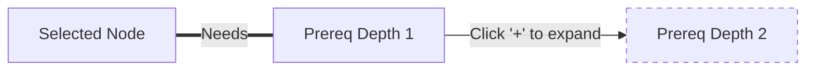

# Design Proposal: Interactive & Uncluttered Focus Mode

This document proposes design options and architectural strategies to solve the clustering and readability issues in the current **Focus Mode** when dealing with deep prerequisite trees.

---

## 1. The Core Challenge
Showing all prerequisite branches recursively up to multiple depths (especially with satisfied and unsatisfied `OR` paths) generates a massive number of virtual junction and ghost nodes. This results in:
* **Visual Clutter:** Overlap of nodes and long crossing edges.
* **Cognitive Overload:** Hard to tell which specific missing module is the actual blocker.
* **Layout Instability:** Large adjustments in node coordinates when shifting focus.

---

## 2. Proposed Design Options

To address this, we propose three distinct interactive paradigms:

### Option A: On-Demand Depth Expansion (Recommended)
Instead of displaying all depths immediately, the graph defaults to showing only **Depth 1** (immediate prerequisites and dependents).
* **How it works:** Nodes with deeper prerequisites render a small interactive controller (e.g., a `+` / `-` toggle button).
* **User Flow:**
  1. User clicks **CS2040S** and enters Focus Mode.
  2. The graph renders **CS2040S**, its direct dependents, and its immediate prerequisites (**CS1010**).
  3. **CS1010** shows a `+` icon indicating it has prerequisites.
  4. The user clicks `+` on **CS1010** to expand its prerequisites, loading the next depth dynamically.



---

### Option B: "Why Am I Blocked?" Explanation Side Panel
Keep the graph visualization focused on a small, readable subset of the neighborhood (e.g. Max Depth 2), but open a dedicated interactive side panel that parses the prerequisite tree into an easy-to-read nested outline.
* **How it works:** Clicking a node opens a sidebar with a structured outline:
  * ❌ **CS2030S** (Not Eligible)
    * ❌ **Prerequisite Formula:** `CS1231S` AND (`CS1010` OR `CS1101S`)
      * ✓ `CS1231S` (Completed in Y1S1)
      * ❌ `CS1010` (Missing)
      * ❌ `CS1101S` (Missing)
* **Visual Aid:** Clicking a missing module in this checklist highlights it (or its placeholder) in the graph.

---

### Option C: Critical Path & Junction Progress Indicators
Enhance the visual language of the graph itself to tell the story of satisfaction clearly.
* **Progress Badges on Junctions:** Instead of showing generic `OR` or `AND` labels, show progress counts like `(0/1 Met)` or `(1/2 Met)`.
* **Path Dimming:** Dim all branches that are not critical. If an `OR` branch is satisfied by one option, fade the other options to 15% opacity to show they exist but are not blocking progress.

```
       [Option A (Completed)]  <-- High opacity (Green)
      /
(OR Gate: 1/2 Met) -- [Target Node]
      \
       [Option B (Missing)]    <-- Dimmed to 15% opacity (Grey/Yellow)
```

---

## 3. Comparison of Design Options

| Feature | Option A: Depth Expansion | Option B: Explanation Sidebar | Option C: Path Highlighting |
| :--- | :--- | :--- | :--- |
| **Clutter Reduction** | **Excellent** (User-controlled) | **Excellent** (Shifted to UI panel) | **Moderate** (Visual dimming) |
| **Explanation Detail** | **Moderate** (Graph nodes only) | **Excellent** (Can write descriptive text) | **Low** (Relies on badges) |
| **Implementation Complexity** | High (State management of tree) | Medium (Separate React component) | Low-Medium (Dagre layout updates) |
| **UX Feel** | Highly interactive, exploratory | Clear, informative, educational | Immediate visual feedback |

---

## 4. How to Show Exactly "Why" Prerequisites are Missing

To give the user clear feedback on why they are blocked, we should introduce:
1. **Interactive Tooltips on Junction Nodes:** Hovering over a red `OR` or `AND` junction node lists the unsatisfied conditions.
2. **Missing State Indicators:** If a module is missing, display a warning icon on the target module card itself:
   * Clicking the warning icon highlights the exact path of red dashed edges leading to the missing root prerequisites.
3. **Semester Timeline Validation Check:** Tie the focus mode warnings back to the planned semester order. If a prerequisite is planned *after* the target module, label the edge as `"Invalid Order"` instead of `"MISSING"`.

---

## 5. Next Steps & Planning

To plan this together, we can utilize:
* **`/plan`**: To outline a step-by-step development plan for the chosen option.
* **`/grill-me`**: To run an interactive interview to align on design details (e.g. style tokens, layout directions, and UI layouts).
