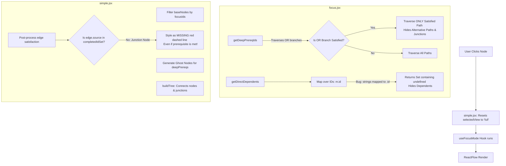

# Focus Mode Issues & Solutions Analysis

This document provides a detailed technical analysis of the issues affecting the graph's **Focus Mode** when selecting nodes in NusTree. It details the exact file locations, root causes, visual impacts, and step-by-step code solutions.

---

## 1. Architectural Flow Diagram

The diagram below illustrates how clicking a node currently processes and renders the graph in focus mode, highlights where the breaks occur, and how they should be corrected.



---

## 2. Detailed Breakdown of Identified Issues

### Issue 1: Selected View Resets to "Full" on Node Click
* **File Location:** [simple.jsx](file:///home/raaghul/orbital/NusTree/src/graph/simple.jsx#L805-L812)
* **Root Cause:** In the node click handler, `setSelectedView("full")` is hardcoded to execute when a new node is selected:
  ```javascript
  const handleNodeClick = useCallback((_, node) => {
    setCustomPositions({});
    setSelectedNode((prev) => {
      if (prev === node.id) return null;
      setSelectedView("full"); // <-- Forces view back to "full"
      return node.id;
    });
  }, [setCustomPositions]);
  ```
* **Visual/User Impact:** If a user is actively using the "Focus" view and clicks another node to inspect its tree, they are forcefully kicked back into the full graph view and must manually click the "Focus" button again.
* **Proposed Solution:** Remove the hardcoded reset so that the selected view mode (Focus or Full) is preserved across selection changes.

---

### Issue 2: Broken Dependents Logic (Dependents Hidden in Focus Mode)
* **File Location:** [focus.jsx](file:///home/raaghul/orbital/NusTree/src/graph/focus.jsx#L84-L89)
* **Root Cause:** The `getDirectDependents` utility returns an array of strings (the dependent module IDs), not objects. Inside the hook, it tries to access `m.id` on those strings:
  ```javascript
  const directDependents = useMemo(() => {
    if (!selectedNode) return new Set();
    return new Set(
      getDirectDependents(selectedNode, mods).map((m) => m.id), // <-- Bug: m is a string, m.id is undefined
    );
  }, [selectedNode, mods]);
  ```
* **Visual/User Impact:** The set of `directDependents` resolves to `Set { undefined }`. Consequently, no dependent nodes are added to the focused ID set, and they are completely filtered out and hidden in Focus Mode.
* **Proposed Solution:** Access the array of strings directly without calling `.map((m) => m.id)`.

---

### Issue 3: OR-Prerequisite Traversal Cutoff (Hides Alternative Paths & Junctions)
* **File Location:** [focus.jsx](file:///home/raaghul/orbital/NusTree/src/graph/focus.jsx#L49-L65)
* **Root Cause:** In `getDeepPrereqIds`, if an OR prerequisite branch is satisfied by one option, the algorithm only traverses the satisfied child and ignores the unsatisfied options:
  ```javascript
  if (treeNode.or) {
    const satisfiedChildren = treeNode.or.filter((child) =>
      isSatisfied(child, completedIdSet),
    );

    if (satisfiedChildren.length > 0) {
      // If the OR condition is satisfied, only traverse/collect the satisfied options
      satisfiedChildren.forEach((child) => {
        getDeepPrereqIds(child, prereqMap, prereqIds, completedIdSet);
      });
    } else {
      // If unsatisfied, we must show all options as missing/ghosts
      treeNode.or.forEach((child) => {
        getDeepPrereqIds(child, prereqMap, prereqIds, completedIdSet);
      });
    }
  }
  ```
* **Visual/User Impact:** 
  1. Alternative pathways are hidden. If a user completed option A but also wants to see option B (and its prerequisite chain), it is completely omitted.
  2. Because only one child makes it into the focus set, `buildTree` simplifies the OR gate: it removes the OR junction node and draws a straight line from the satisfied node to the target. The user has no visual indicator that an OR gate existed or that alternative options are available.
* **Proposed Solution:** Always traverse all branches of OR conditions so that the entire tree layout remains visible, displaying satisfied options (green), planned options (blue), and missing options (yellow/ghost) together with their proper OR junctions.

---

### Issue 4: Junction Edges Stuck as "MISSING"
* **File Location:** [simple.jsx](file:///home/raaghul/orbital/NusTree/src/graph/simple.jsx#L758-L783)
* **Root Cause:** Edge post-processing checks satisfaction using `completedIdSet.has(edge.source)`:
  ```javascript
  const processedEdges = resultEdges.map((edge) => {
    const isGhostSource = ghostNodes.some((gn) => gn.id === edge.source);
    const isSatisfied = completedIdSet.has(edge.source); // <-- Virtual junctions are not in completedIdSet!
    if (!isSatisfied) {
      return {
        ...edge,
        style: {
          ...edge.style,
          stroke: "#d10000",
          strokeDasharray: "5,5",
          ...
  ```
  Since virtual junction IDs (e.g., `junction-or-...`) are not in `completedIdSet`, the edge from the junction to the target node is always treated as unsatisfied.
* **Visual/User Impact:** Even when the OR condition is fully satisfied (e.g., the user completed a prerequisite option), the line connecting the OR junction to the module remains red, dashed, and labeled `"MISSING"`.
* **Proposed Solution:** Add a recursive validation helper `isEdgeSourceSatisfied` that checks if the junction is satisfied by seeing if any of its children are completed.

---

### Issue 5: Hardcoded Ghost Node State
* **File Location:** [simple.jsx](file:///home/raaghul/orbital/NusTree/src/graph/simple.jsx#L308-L314)
* **Root Cause:** Missing prerequisites that are rendered as ghost nodes are instantiated with a hardcoded state of `1` (which corresponds to planned/eligible):
  ```javascript
  return {
    id: prereq,
    type: "moduleNodeType",
    position: layoutPosition ?? { x: baseX + index * 160, y: baseY - 120 },
    data: {
      label: prereq,
      title: modObj?.title || "Unknown Title",
      description: modObj?.description || "",
      isGhost: true,
      state: 1, // <-- Hardcoded state 1
    },
    ...
  ```
* **Visual/User Impact:** Context menus and UI behaviors for missing prerequisite ghost nodes show options as if they are planned (state 1) instead of warning/invalid/missing (state 3).
* **Proposed Solution:** Set the `state` of ghost nodes to `3` (warning/unmet) or compute it dynamically to reflect their missing status.

---

### Issue 6: Dead and Malformed Utility File
* **File Location:** [focusUtilities.js](file:///home/raaghul/orbital/NusTree/src/graph/focusUtilities.js)
* **Root Cause:** Contains unfinished stub functions (`buildDependentTree` is empty), syntax bugs (`foreach` instead of `forEach`), and undeclared variables (`oneDepthMods`). The file is never imported anywhere in the project.
* **Proposed Solution:** Delete this file to prevent developer confusion and keep the workspace clean.

---

## 3. Code Solution Blueprints

### A. Fixes for [focus.jsx](file:///home/raaghul/orbital/NusTree/src/graph/focus.jsx)

```diff
- const getDeepPrereqIds = (treeNode, prereqMap, prereqIds, completedIdSet) => {
+ const getDeepPrereqIds = (treeNode, prereqMap, prereqIds) => {
    if (!treeNode) return;
  
    // Case 1: treeNode is a string (module ID)
    if (typeof treeNode === "string") {
      const code = treeNode.split(":")[0].replace("%", "");
      if (!prereqIds.has(code)) {
        prereqIds.add(code);
        // Recursively traverse this module's own prerequisite tree
        const nextTree = prereqMap.get(code);
        if (nextTree) {
-         getDeepPrereqIds(nextTree, prereqMap, prereqIds, completedIdSet);
+         getDeepPrereqIds(nextTree, prereqMap, prereqIds);
        }
      }
      return;
    }
  
    // Case 2: treeNode has "and" branch
    if (treeNode.and) {
      treeNode.and.forEach((child) => {
-       getDeepPrereqIds(child, prereqMap, prereqIds, completedIdSet);
+       getDeepPrereqIds(child, prereqMap, prereqIds);
      });
      return;
    }
  
    // Case 3: treeNode has "or" branch
    if (treeNode.or) {
-     const satisfiedChildren = treeNode.or.filter((child) =>
-       isSatisfied(child, completedIdSet),
-     );
- 
-     if (satisfiedChildren.length > 0) {
-       // If the OR condition is satisfied, only traverse/collect the satisfied options
-       satisfiedChildren.forEach((child) => {
-         getDeepPrereqIds(child, prereqMap, prereqIds, completedIdSet);
-       });
-     } else {
-       // If unsatisfied, we must show all options as missing/ghosts
-       treeNode.or.forEach((child) => {
-         getDeepPrereqIds(child, prereqMap, prereqIds, completedIdSet);
-       });
-     }
+     treeNode.or.forEach((child) => {
+       getDeepPrereqIds(child, prereqMap, prereqIds);
+     });
    }
  };
```

```diff
  const directDependents = useMemo(() => {
    if (!selectedNode) return new Set();
    return new Set(
-     getDirectDependents(selectedNode, mods).map((m) => m.id),
+     getDirectDependents(selectedNode, mods),
    );
  }, [selectedNode, mods]);
```

---

### B. Fixes for [simple.jsx](file:///home/raaghul/orbital/NusTree/src/graph/simple.jsx)

#### 1. Keep selected view when clicking nodes:
```diff
  const handleNodeClick = useCallback((_, node) => {
    setCustomPositions({});
    setSelectedNode((prev) => {
      if (prev === node.id) return null;
-     setSelectedView("full");
+     // Preserve current selectedView (focus or full)
      return node.id;
    });
  }, [setCustomPositions]);
```

#### 2. Set correct state for ghost nodes:
```diff
        return {
          id: prereq,
          type: "moduleNodeType",
          position: layoutPosition ?? { x: baseX + index * 160, y: baseY - 120 },
          data: {
            label: prereq,
            title: modObj?.title || "Unknown Title",
            description: modObj?.description || "",
            isGhost: true,
-           state: 1,
+           state: 3, // Missing prerequisite warning state
          },
```

#### 3. Resolve Junction Edge Satisfaction styling:
Add the helper outside the component block:
```javascript
const isEdgeSourceSatisfied = (source, completedIdSet) => {
  if (completedIdSet.has(source)) return true;
  if (source.startsWith("junction-or-")) {
    const parts = source.replace("junction-or-", "").split("-");
    const children = parts.slice(1);
    return children.some((child) => isEdgeSourceSatisfied(child, completedIdSet));
  }
  return false;
};
```
Then update the map logic for `processedEdges`:
```diff
    const processedEdges = resultEdges.map((edge) => {
      const isGhostSource = ghostNodes.some((gn) => gn.id === edge.source);
-     const isSatisfied = completedIdSet.has(edge.source);
+     const isSatisfied = isEdgeSourceSatisfied(edge.source, completedIdSet);
      if (!isSatisfied) {
        return {
          ...edge,
          style: {
            ...edge.style,
            stroke: "#d10000",
            strokeDasharray: "5,5",
```
